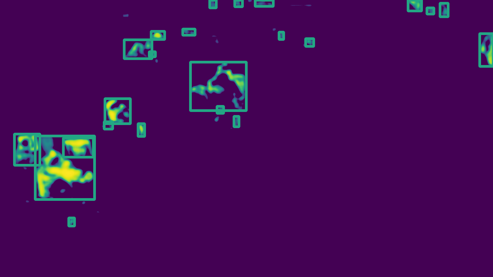
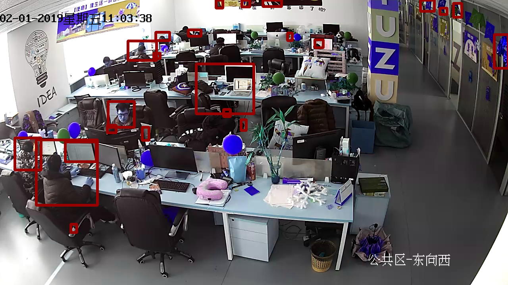

# Movement Detection with OpenCV
Use background subtractor from OpenCV to generate heat map from any recordings. The camera must be static.

## Usage
```
background_diff(filename, frame_num = -1, bkg_construct_frame = 800, frame_freq = 10, mv_avr_width = 70, post_process = False, video_save_path = 'out.mp4', post_process_method="BLUR")
```
Parameters:
    - **filename**: Path to input file.
    - **frame_num**: Frames to use as input, -1 means all frames in the original file.
    - **bkg_construct_frame**: Frames to use for constructing the background subtractor.
    - **frame_freq**: Frequencty of sampling.
    - **mv_avr_width**: Width of the moving average. This decides the second returned output.
    - **post_process**: Post process method on reducing noises.
    - **post_process_method**: Method of post process, "BLUR" or "MORPH".
    - **video_save_path**: Path to save the output video. If that's not needed, just delete the relevant code.

```
select_from_heatmap(hmap,FILENAME)
```
Parameters:
    - **hmap**: A heat map image. Must be in the format np.uint8.
    - **FILENAME:**: Path to input file.

## Notes
See notes in the notebook.

## Demo
A sample frame from a surveillance camera in some company.

